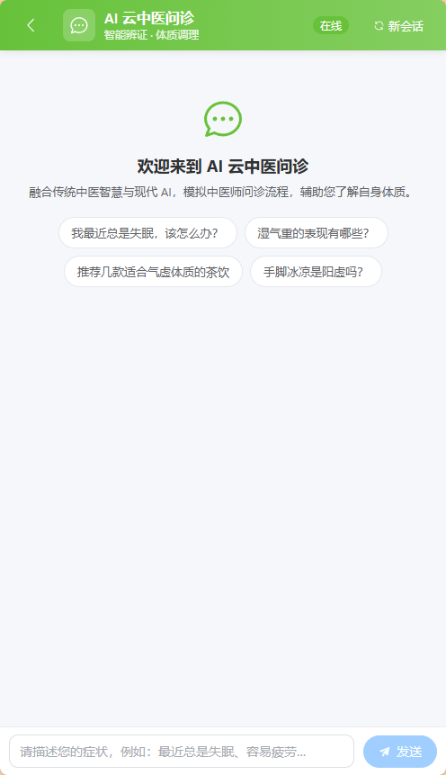
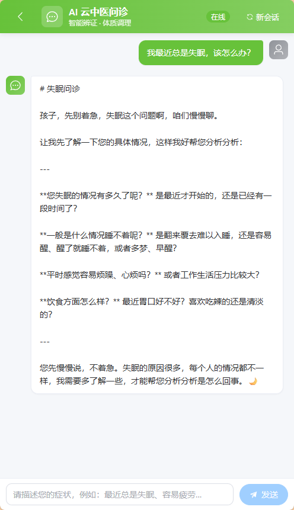
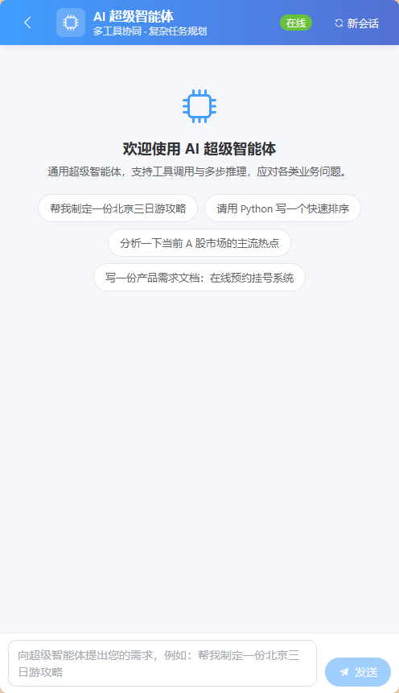
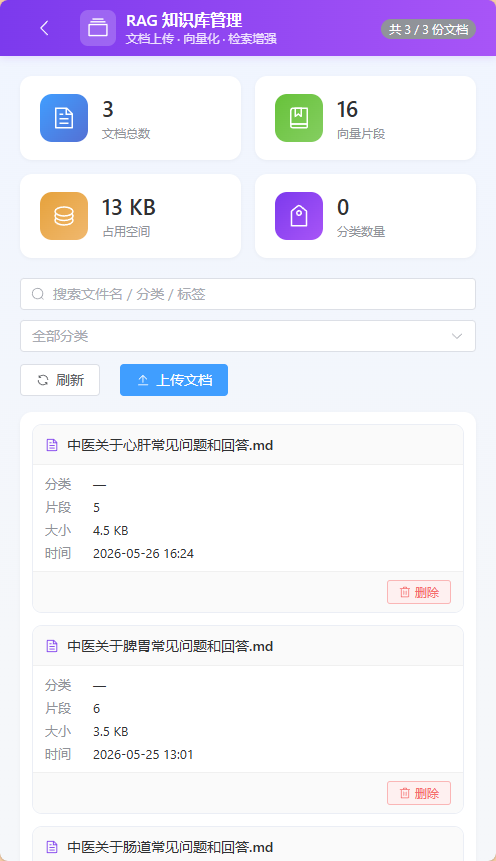

<div align="center">

# 🩺 AI Smart Cloud · 智能云中医 & 超级智能体

**融合 Spring AI + 大模型 + MCP 协议 + 向量检索的全栈 AI 应用平台**

*让 AI 不止是聊天，更是会"望闻问切"的中医老爷爷，和会"调度工具"的超级助理*

<br>


<br>

[功能特色](#-功能特色) · [架构设计](#-架构设计) · [快速开始](#-快速开始) · [应用演示](#-应用演示) · [API 文档](#-api-文档)

</div>

---

## ✨ 这是一个怎样的项目

**AI Smart Cloud** 一个**真正生产可用**的全栈 AI 应用底座。它把当下最热门的 AI 工程化技术一网打尽：

- 🤖 **两大旗舰应用**：垂直领域的 **AI 云中医问诊**（模拟 40 年经验老中医） + 通用领域的 **AI 超级智能体**（自主规划 + 工具调用）
- 🧠 **大模型双剑合璧**：对话用 **MiniMax-M2.7-highspeed**（国产推理大模型），向量化用 **Qwen3-Embedding-0.6B**（阿里通义嵌入模型）
- 🔌 **MCP 协议原生支持**：通过 stdio 协议接入 [Amap 高德地图 MCP Server](https://github.com/amap/amap-maps-mcp-server)，让 AI 拥有调用外部世界的能力
- 🛠️ **自研 ReAct + Tool Calling 智能体框架**：从零实现 `ReActAgent → ToolCallAgent → MyManus` 的三层 Agent 体系，**最大 20 步自主规划**
- 📚 **双模 RAG 引擎**：内置 `SimpleVectorStore`（开发期） + `PgVectorStore`（生产期），按场景无缝切换
- ⚡ **全链路 SSE 流式**：从后端 `Flux<ServerSentEvent>` 到前端自定义 `SSEParser`，**打字机效果**
- 🩺 **中医垂直 Prompt 工程**：超 2000 字的 System Prompt，把"望闻问切""辨证论治"等中医方法论工程化

---

## 🎬 应用演示

> 实际运行截图（点击图片可放大查看）

### 1. AI 云中医问诊 · 欢迎页
**体质辨识 · 亚健康调理**

<p align="center">
  
</p>

> 经典的中医诊所气质：清新绿主题、温和可亲的引导语、4 个常见养生问题作为快捷入口（失眠、湿气、阳虚、气虚）。降低用户首次使用的门槛。

### 2. AI 云中医问诊 · 深度问诊过程
**"望闻问切"工程化的最佳体现**

<p align="center">
  
</p>

> 注意看 AI 是怎么回复的——它**没有急着给结论**，而是先安抚用户情绪（"孩子，先别着急"），再按"主诉收集 → 追问细节 → 引导描述"的标准中医问诊流程分步推进。每一步只问 1-3 个关键问题，让用户感觉真的在和一位老中医交流。

### 3. AI 超级智能体 · 工具调用型 Agent
**多工具协同 · 复杂任务规划**

<p align="center">
  
</p>

> 与中医应用的"垂直专精"不同，超级智能体走的是"通用全能"路线。它能调度 7 个内置工具（Web 搜索、网页抓取、文件操作、PDF 生成、终端命令、资源下载、终止控制），自主拆解复杂任务——"北京三日游攻略"会触发"搜索 → 抓取 → 整理 → PDF 输出"的完整链路。


### 4. RAG知识库管理 · 移动端

**文档上传 · 向量化 · 检索增强**

<p align="center">
  
</p>

> 这是面向**运维 / 领域专家**的"知识库驾驶舱"。后端通过 `RagController` 提供完整生命周期管理：`POST /rag/upload` 上传 Markdown 自动切分并写入向量库；`GET /rag/files` 拉取源文件元数据；`DELETE /rag/files/{fileHash}` 一键清空某个文件的全部分片。前端则用四张统计卡（文档数 / 向量片段 / 占用空间 / 分类数）+ 实时搜索 + 分类筛选，把向量库的状态一目了然地呈现出来。响应式布局：桌面端用表格，移动端（< 768px）自动切换为卡片视图，运维同学在手机上也能随时巡检。

---

## 🏆 功能特色

### 🩺 智能云中医问诊（TCM App）

- ✅ **超长 System Prompt 工程化**：2000+ 字角色设定，把 40 年老中医的"望闻问切"流程化为可计算的对话模板
- ✅ **多轮对话记忆**：基于 `MessageWindowChatMemory`（滑动窗口 20 轮），理解上下文追问
- ✅ **结构化输出**：内置 `ConsultationReport` 实体类，可自动生成"问诊报告"
- ✅ **流式 + 同步双模式**：同一接口既支持 SSE 打字机，也支持传统同步调用
- ✅ **RAG 增强**：可加载 `classpath:document/` 下的中医知识库 Markdown，实现"知识库 + LLM"双驱动
- ✅ **PG 向量检索**：阈值 0.50 的相似度过滤，避免无效上下文污染 Prompt

### 🤖 AI 超级智能体（Manus Agent）

- ✅ **自研三层 Agent 架构**：`BaseAgent` 抽象基类 → `ReActAgent` 思考-执行循环 → `ToolCallAgent` 工具调度 → `MyManus` 业务实例
- ✅ **ReAct 推理模式**：Thought → Action → Observation 循环，**最多 20 步自主规划**
- ✅ **禁用 Spring AI 内置工具调度**：手动维护消息上下文和工具状态，更可控、更易调试
- ✅ **7 个开箱即用工具**（详见 [工具目录](#-工具目录)）
- ✅ **MCP 协议支持**：通过 `mcp-servers.json` 动态挂载外部 MCP Server（已对接高德地图）
- ✅ **Re2 增强推理**：内置 `ReReadingAdvisor`，让 LLM 重新阅读问题提升推理质量

### 🎨 现代化前端

- ✅ **Vue 3 + TypeScript + Vite 5**：类型安全 + HMR 极速开发体验
- ✅ **Element Plus 移动端适配**：响应式布局，从 PC 到手机一气呵成
- ✅ **SSE 打字机效果**：自研 `SSEParser`（`fetch + ReadableStream`），严格遵循"一次 SSE 调用 = 一个 AI 消息气泡"规范
- ✅ **可复用 ChatRoom 组件**：主题色 / 图标 / 提示语全部 Props 化，新增应用仅需 < 50 行代码
- ✅ **优雅的交互细节**：停止生成、新会话、加载动画、错误兜底、键盘快捷键（Enter 发送 / Shift+Enter 换行）

### 🏗️ 工程化亮点

- ✅ **双模 RAG**：开发期 `SimpleVectorStore`（内存），生产期 `PgVectorStore`（PG + pgvector）
- ✅ **Knife4j OpenAPI 文档**：所有接口自动生成 Swagger UI
- ✅ **统一异常拦截 + 标准化响应**
- ✅ **Maven Wrapper + npm 双端构建**：开箱即用，无需配置
- ✅ **完善的单元测试**：核心工具类、AI 应用、Agent 都有测试覆盖

---

## 🧬 架构设计

### 整体架构

```
┌─────────────────────────────────────────────────────────────────┐
│                        Vue 3 Frontend                           │
│   Home ── ChatRoom (TCM) ── ChatRoom (Manus)                   │
│   Vite Proxy → localhost:38022/api                              │
└────────────────────┬────────────────────────────────────────────┘
                     │  SSE (text/event-stream)
                     ▼
┌─────────────────────────────────────────────────────────────────┐
│                  Spring Boot 3.4.4 Backend                      │
│  ┌──────────┐  ┌──────────┐  ┌──────────┐  ┌──────────┐        │
│  │AiCtrl /  │  │TCMApp /  │  │ MyManus  │  │  Tools   │        │
│  │RagCtrl/  │  │(Prompt+  │  │ (ReAct + │  │  7 个   │        │
│  │HealthCtrl│  │ Memory+  │  │  ToolCall│  │  内置    │        │
│  └────┬─────┘  │ RAG)     │  │  Agent)  │  └────┬─────┘        │
│       │        └────┬─────┘  └────┬─────┘       │              │
│       │             │             │             │              │
│       └─────────────┴─────┬───────┴─────────────┘              │
│                           ▼                                    │
│              ┌────────────────────────┐                         │
│              │  Spring AI 1.1.6 抽象层 │                         │
│              │  ChatClient + Advisors │                         │
│              └────────┬───────────────┘                         │
│                       │                                         │
│       ┌───────────────┼────────────────┐                        │
│       ▼               ▼                ▼                        │
│  ┌─────────┐   ┌──────────┐    ┌──────────┐                     │
│  │ MiniMax │   │ Qwen     │    │   MCP    │                     │
│  │  LLM    │   │Embedding │    │ stdio    │                     │
│  │(硅基/   │   │(硅基流动)│    │(高德地图)│                     │
│  │ MiniMax)│   │          │    │          │                     │
│  └─────────┘   └────┬─────┘    └──────────┘                     │
│                     │                                           │
│                     ▼                                           │
│         ┌──────────────────────┐                                │
│         │  Vector Store        │                                │
│         │  - SimpleVectorStore │                                │
│         │  - PgVectorStore     │                                │
│         └──────────────────────┘                                │
└─────────────────────────────────────────────────────────────────┘
```

### Agent 推理时序（MyManus 一次完整思考）

```
用户输入: "帮我查一下北京今天天气"
                    │
                    ▼
        ┌───────────────────────┐
   ①   │   MyManus.think()     │  ← ReActAgent 思考
        │   - 解析问题           │
        │   - LLM 返回 ToolCall  │
        │   - 选择 amap_maps     │
        └──────────┬────────────┘
                   ▼
        ┌───────────────────────┐
   ②   │   MyManus.act()       │  ← ToolCallAgent 执行
        │   - 调用 MCP 工具     │
        │   - 获取天气数据       │
        │   - 追加到消息历史     │
        └──────────┬────────────┘
                   ▼
        ┌───────────────────────┐
   ③   │   MyManus.think()     │  ← 第二轮思考
        │   - LLM 整理结果       │
        │   - 不需要更多工具     │
        │   - 返回 false 终止    │
        └──────────┬────────────┘
                   ▼
        ┌───────────────────────┐
   ④   │   SSE 流式输出最终回复  │
        │   北京今天晴，23°C     │
        └───────────────────────┘
```

---

## 🚀 技术栈详解

### 对话大模型：MiniMax-M2.7-highspeed

| 项目 | 说明 |
|------|------|
| **厂商** | MiniMax（深度求索） |
| **模型** | MiniMax-M2.7-highspeed |
| **特点** | 高速度推理版本，4096 max tokens，温度 0.7 |
| **接入方式** | `spring-ai-starter-model-minimax` |
| **API Key** | `${MINIMAX_API_KEY}` |

> 选择 MiniMax 的原因：国产开源大模型第一梯队，中文语境理解优秀，对工具调用（Function Call）支持稳定，且 API 价格远低于 GPT-4。

### 嵌入模型：Qwen3-Embedding-0.6B

| 项目 | 说明 |
|------|------|
| **厂商** | 阿里通义千问（Qwen 团队） |
| **模型** | `Qwen/Qwen3-Embedding-0.6B` |
| **维度** | 1024 维 |
| **接入方式** | OpenAI 兼容 API（通过[硅基流动 SiliconFlow](https://siliconflow.cn)中转） |
| **使用场景** | TCM 知识库 RAG 文档向量化 |

> 选择 Qwen Embedding 的原因：6 亿参数级别最适合中文 RAG 场景，在 CMTEB 中文检索榜上表现优异，1024 维向量兼顾精度和存储成本。

### MCP 协议接入

**MCP（Model Context Protocol）** 是 Anthropic 主导的开放协议，用于让 LLM 安全地调用外部工具。本项目已对接：

| MCP Server | 用途 | 启动方式 |
|------------|------|----------|
| `@amap/amap-maps-mcp-server` | 高德地图服务（天气、POI、路径规划） | stdio 子进程（通过 `npx.cmd -y` 启动） |

**配置位置**：`src/main/resources/mcp-servers.json`

```json
{
  "mcpServers": {
    "amap-maps": {
      "command": "npx.cmd",
      "args": ["-y", "@amap/amap-maps-mcp-server"],
      "env": { "AMAP_MAPS_API_KEY": "your-key" }
    }
  }
}
```

新增 MCP 工具**无需改一行 Java 代码**，只需在 `mcp-servers.json` 中追加配置即可。

---

## 🛠️ 工具目录

`MyManus` 内置了 7 个开箱即用的工具，可自由组合完成复杂任务：

| 工具类 | 工具名 | 功能描述 |
|--------|--------|----------|
| `FileOperationTool` | `read_file` / `write_file` | 读取 / 写入本地文件 |
| `WebSearchTool` | `web_search` | 基于 searchapi.io 的百度搜索（返回 Top 5） |
| `WebScrapingTool` | `web_scrape` | 用 Jsoup 抓取网页正文 |
| `ResourceDownloadTool` | `download_resource` | 下载网络资源到本地 |
| `TerminalOperationTool` | `terminal_operation` | 执行本地终端命令（带安全限制） |
| `PDFGenerationTool` | `pdf_generate` | 用 iText 生成 PDF 文档 |
| `TerminateTool` | `terminate` | Agent 主动终止当前任务 |

> **安全说明**：所有工具都通过 Spring AI 的 `ToolCallback` 机制注册，LLM 只能调用声明过的工具，无法绕过限制直接访问系统。

---

## 🚦 快速开始

### 环境要求

- **JDK**: 21+
- **Maven**: 3.8+ （项目已带 `mvnw`）
- **Node.js**: >= 20.20.2（前端）
- **PostgreSQL**: 17+（仅生产模式 RAG 必需，开发期可用 SimpleVectorStore）
- **PGvector**：1.8
- **npx**: 必需（MCP Server 通过 npx 启动）

### 1. 克隆 & 配置环境变量

```bash
git clone <repo-url> ai-smart-tcm
cd ai-smart-tcm
```

在系统环境变量（或 IDE VM Options）配置以下 Key：

```bash
# 必填：MiniMax 大模型
MINIMAX_API_KEY=sk-cp-xxxxxxxxxxxx

# 必填：硅基流动（用于 Qwen Embedding）
SILICONFLOW_API_KEY=sk-xxxxxxxxxxxx

# 必填：searchapi.io（Web 搜索工具）
SEARCH_API_KEY=xxxxxxxxxxxx

# 可选：高德地图 MCP（如不使用地图相关功能可跳过）
AMAP_MAPS_API_KEY=xxxxxxxxxxxx

# 可选：PostgreSQL（不填则降级为 SimpleVectorStore）
POSTGRES_PASSWORD=xxxxxxxxxxxx
```

### 2. 启动后端

```bash
./mvnw spring-boot:run
# 或
mvn spring-boot:run
```


### 3. 启动前端

```bash
cd ai-smart-tcm-frontend
npm install --registry=https://registry.npmmirror.com
npm run dev
```

前端开发地址：`http://localhost:5173`

### 4. 体验应用

- 浏览器打开 `http://localhost:5173`
- 点击 **"AI 云中医问诊"** 卡片 → 描述身体状况（如"最近总是失眠"）→ 体验老中医问诊
- 返回主页点击 **"AI 超级智能体"** → 输入复杂任务（如"帮我查北京今天天气并整理成 PDF"）

### 5. 访问 Knife4j API 文档

`http://localhost:38022/api/swagger-ui.html` 查看所有后端接口的 OpenAPI 文档。

---

## 📂 项目结构

```
ai-smart-tcm/
├── src/main/java/com/bobo/aismartcloud/
│   ├── AiSmartCloudApplication.java    # 启动类
│   ├── advisor/                         # ChatClient Advisor 拦截器
│   │   ├── MyLoggerAdvisor.java        # 自定义日志 Advisor
│   │   └── ReReadingAdvisor.java       # Re2 推理增强
│   ├── agent/                           # 自研 Agent 框架
│   │   ├── BaseAgent.java              # Agent 抽象基类
│   │   ├── ReActAgent.java             # ReAct 推理模式
│   │   ├── ToolCallAgent.java          # 工具调用 Agent
│   │   └── MyManus.java                # 超级智能体实例
│   ├── app/TCMApp.java                  # AI 中医问诊应用
│   ├── config/                          # 全局配置（CORS、Knife4j）
│   ├── constant/                        # 常量定义
│   ├── controller/                      # REST 控制器
│   │   ├── AiController.java           # AI 对话接口（SSE）
│   │   ├── RagController.java          # RAG 知识库接口
│   │   └── HealthController.java       # 健康检查
│   ├── demo/invoke/                     # 各种 LLM 调用方式 Demo
│   ├── rag/                             # RAG 模块
│   │   ├── TCMDcoumentLoader.java      # 文档加载
│   │   ├── MyKeywordEnricher.java      # 关键词增强
│   │   ├── MyTokenTextSplitter.java    # Token 切分
│   │   ├── TCMVectorStoreConfig.java   # 内存向量库配置
│   │   ├── TCMPgVectorStoreConfig.java # PG 向量库配置
│   │   ├── TCMAppContextualQueryAugmenterFactory.java
│   │   ├── service/TCMVectorDbService.java
│   │   ├── parser/                      # 文档解析（Markdown/PDF）
│   │   ├── entity/                      # 实体类
│   │   └── mapper/                      # MyBatis Mapper
│   └── tools/                           # 智能体工具集
│       ├── FileOperationTool.java
│       ├── WebSearchTool.java
│       ├── WebScrapingTool.java
│       ├── ResourceDownloadTool.java
│       ├── TerminalOperationTool.java
│       ├── PDFGenerationTool.java
│       ├── TerminateTool.java
│       └── ToolRegistration.java        # 工具注册中心
├── src/main/resources/
│   ├── application.yml                  # Spring Boot 配置
│   ├── mcp-servers.json                 # MCP Server 配置
│   └── document/                        # TCM 知识库 Markdown
├── src/test/                            # 单元测试
├── ai-smart-tcm-frontend/               # 前端项目
└── README.md                            # 你正在看的这个文件
```

---

## 📡 API 文档

后端所有接口统一前缀：`http://localhost:38022/api`

### AI 对话接口（SSE 流式）

| 接口 | 方法 | 参数 | 用途 |
|------|------|------|------|
| `/ai/tcm_app/chat/sse` | GET | `message`, `chatId` | 云中医问诊流式 |
| `/ai/manus/chat` | GET | `message` | 超级智能体流式 |
| `/ai/tcm_app/chat/sync` | GET | `message`, `chatId` | 云中医同步调用 |

完整接口列表见 Knife4j 文档：`http://localhost:38022/api/swagger-ui.html`

### 前端 SSE 消息格式

每个事件形如：

```
data: <文本片段>

```

（空行 `\n\n` 分隔事件）

前端 `SSEParser` 严格遵循 **"一次 SSE 调用 = 一个 AI 消息气泡"** 规范，文本碎片持续追加到同一条消息记录中，实现丝滑打字机效果。

---

## 🗺️ 路线图

- [x] ✅ 双应用（TCM + Manus）
- [x] ✅ 自研 ReAct + Tool Calling Agent
- [x] ✅ MCP 协议接入
- [x] ✅ 双模 RAG（内存 + PG）
- [x] ✅ 全链路 SSE 流式
- [ ] 🔲 接入更多 MCP Server（飞书、Notion、GitHub）
- [ ] 🔲 Agent 思考过程可视化（前端展示 Thought → Action → Observation）
- [ ] 🔲 多用户 + 会话持久化（PostgreSQL 存储聊天记录）
- [ ] 🔲 Docker Compose 一键部署
- [ ] 🔲 完整的 Playwright 端到端测试

---

## 🤝 贡献

欢迎 PR / Issue！提交前请确保：

1. 后端代码遵循阿里巴巴 Java 开发手册
2. 前端代码通过 `npm run type-check` 与 `npm run build`
3. 涉及核心逻辑的改动附上单元测试
4. 涉及 MCP / LLM 相关改动在 README 中同步更新

---

## 📄 License

[MIT](LICENSE) © 2026 AI Smart Cloud Contributors

---

<div align="center">

**⭐ 如果这个项目对你有帮助，欢迎点个 Star！**

Made with ❤️ by [sulongbo](https://github.com/sulongbo) · 2026

</div>
